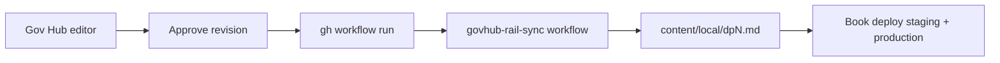

# Gov Hub → book rail sync

How approved Gov Hub revisions flow into the Desirable Properties book local rails
(`desirableproperties-book/content/local/dpN.md`).

This is the **inverse** of [GOVHUB-DP-PUBLISH.md](./GOVHUB-DP-PUBLISH.md), which pushes local
rails *to* Gov Hub. For the DP book project, **Gov Hub is the editorial source of truth**; the
local rails are a synced copy the BRC333 book reads via `localOverride` in `sources-sat.json`.

## Scripts

| Script | Purpose |
| --- | --- |
| `scripts/govhub_sync_rails_from_hub.py` | Pull latest approved revision per ML-Draft → `content/local/dpN.md` |
| `scripts/govhub_dp_common.py` | Shared mapping + fetch helpers |
| `scripts/check-rails-protected.sh` | Block unauthorized direct edits to `dp*.md` |
| `scripts/test_govhub_sync_rails.py` | Unit tests (mapping, sync marker helpers) |
| `.github/workflows/govhub-rail-sync.yml` | Event-driven + scheduled auto-sync from production Gov Hub |

## Environments

| | Hub URL | Local DB (optional) |
| --- | --- | --- |
| DEV | `https://dev.hub.themetalayer.org` | `gov-hub-dev/instance_dev/datatracker_dev.db` |
| LIVE (default) | `https://hub.themetalayer.org` | `gov-hub-prod/instance/datatracker.db` |

Use `--env main` (default) or `--env dev` (`development` / `production` also accepted). Override
with `--hub-url` if needed. With `--local-db`, `--env` also picks the default Gov Hub checkout and
`FLASK_ENV` (same mapping as `govhub_publish_dp_revisions.py`).

## Syncing

Preview changes (no writes):

```bash
cd /home/ubuntu/desirable-properties
python3 scripts/govhub_sync_rails_from_hub.py --dry-run
```

Write all chapters from production hub API:

```bash
python3 scripts/govhub_sync_rails_from_hub.py
git add desirableproperties-book/content/local/dp*.md
git commit -m "sync: pull DP rails from Gov Hub main [rail-sync]"
```

Useful flags:

| Flag | Meaning |
| --- | --- |
| `--only DP1,DP13` | Sync specific chapters |
| `--local-db` | Read from local Gov Hub SQLite instead of HTTP |
| `--govhub-root /path/to/gov-hub-dev` | Gov Hub checkout for `--local-db` |
| `--content-dir`, `--sources-sat` | Alternate book paths |
| `--report /tmp/sync.json` | JSON run report |

### HTTP API (default)

For each ML number in `sources-sat.json`:

1. `GET /api/doc/draft/<ml_number>/read-meta/` → served `submission_id`
2. `GET /doc/draft/<submission_id>.txt` → stored upload (markdown in `.txt`)

The ML-number `.txt` URL alone is **not** used — it resolves to the Rev 00 parent, which often
has no upload when a newer approved revision exists.

### Local database (`--local-db`)

For automation without network access, point at a Gov Hub checkout and use the same SQLite +
Flask resolution as the publish script (`get_readable_submission_by_ref`).

```bash
python3 scripts/govhub_sync_rails_from_hub.py \
  --local-db \
  --govhub-root /home/ubuntu/gov-hub-dev \
  --dry-run
```

## Sync metadata stamp

Each synced rail carries an HTML comment near the top:

```html
<!-- govhub-sync: ml=ML-Draft-008 revision=02 submission=<uuid> hash=<prefix> synced=2026-08-03T12:00:00Z -->
```

The sync script updates this line whenever the Gov Hub body changes. Existing
`dp-local-version` comments are preserved.

## Edit protection

Direct edits to `dp1.md` … `dp23.md` are discouraged and guarded:

| Layer | Behavior |
| --- | --- |
| `content/local/README.md` | Documents the Gov Hub–only workflow |
| `scripts/check-rails-protected.sh` | Fails on staged `dp*.md` changes unless authorized |
| `.github/workflows/check-rails-source.yml` | CI on PRs touching `dp*.md` |
| `.cursor/rules/dp-rails-govhub-sync.mdc` | Cursor agent guidance |

**Authorized** rail edits (any one):

- Commit message contains `[rail-sync]` (use after running the sync script)
- PR label `rail-sync`
- `ALLOW_RAIL_EDIT=1` for a local override

Pre-commit hook (optional):

```bash
printf '%s\n' '#!/bin/sh' 'scripts/check-rails-protected.sh' > .git/hooks/pre-commit
chmod +x .git/hooks/pre-commit
```

## Tests

```bash
python3 scripts/test_govhub_sync_rails.py
python3 scripts/govhub_sync_rails_from_hub.py --dry-run
```

## Automatic sync (GitHub Actions)

The **Gov Hub rail sync** workflow pulls from production Gov Hub and, when rails change, deploys
the book to the VPS (staging first, then production).

| | |
| --- | --- |
| Workflow | `.github/workflows/govhub-rail-sync.yml` |
| Primary trigger | `repository_dispatch` event `govhub-rail-sync` (Gov Hub revision approval) |
| Fallback schedule | Daily at 06:00 UTC (`0 6 * * *`) |
| Source | Production Gov Hub API (`--env main`, default) |
| Deploy | SSH to VPS → `deploy-staging-book.sh` → `deploy.sh` (only when rails changed) |
| Commit tag | `[rail-sync]` (passes rail edit protection) |

### Manual trigger

**Actions tab:** open **Gov Hub rail sync** → **Run workflow**. Optional inputs:

- **env** — `main` (default) or `dev`
- **dry_run** — preview only; no file writes, commits, or deploy

**GitHub CLI:**

```bash
gh workflow run govhub-rail-sync.yml --repo shiftshapr/desirable-properties
gh workflow run govhub-rail-sync.yml --repo shiftshapr/desirable-properties -f env=main -f dry_run=true
```

### Gov Hub webhook (primary path)

When a DP book **revision** is approved on production Gov Hub, Gov Hub POSTs a GitHub
`repository_dispatch` to this repo (event type `govhub-rail-sync`). That runs sync immediately
instead of waiting for the daily fallback schedule.

Gov Hub hook location: `services/dp_rail_sync_dispatch.py`, called from
`routes/submissions.py` after revision approval.

Example payload:

```json
POST /repos/shiftshapr/desirable-properties/dispatches
{
  "event_type": "govhub-rail-sync",
  "client_payload": {
    "env": "main",
    "ml_number": "ML-Draft-008",
    "revision_number": "02",
    "submission_id": "<uuid>"
  }
}
```

### Required secrets

**GitHub Actions** (`shiftshapr/desirable-properties`):

| Secret | Purpose |
| --- | --- |
| `HOST` | VPS hostname for SSH deploy (same as challenge-site deploy) |
| `USERNAME` | SSH user (typically `ubuntu`) |
| `SSH_KEY` | Private key for VPS SSH |

**Gov Hub production** (`.env` + VPS `gh auth login`):

| Env var | Purpose |
| --- | --- |
| `GOVHUB_DP_RAIL_SYNC_DISPATCH` | Set `true` to trigger sync on DP revision approval |
| `GITHUB_REPO` | Target repo (default `shiftshapr/desirable-properties`) |
| `DP_RAIL_SYNC_ENV` | Hub env for sync workflow (default `main`) |
| `DP_RAIL_SYNC_ML_NUMBERS` | Extra ML numbers to watch (default includes `ML-Draft-026` intro and `ML-Draft-033` cover) |

**No PAT required.** Gov Hub calls `gh workflow run govhub-rail-sync.yml` using the VPS
[`gh auth login`](https://cli.github.com/manual/gh_auth_login) session (`~/.config/gh/hosts.yml`).
Ensure `gh auth status` works as the service user. Optional legacy: `GH_DISPATCH_TOKEN` if gh
is unavailable.

The workflow uses the built-in `GITHUB_TOKEN` for commit/push inside Actions.

## BRC333 project config

Per-project Gov Hub sync is configured in the BRC333 repo:

`BRC333/projects/desirableproperties-book-ordinal/project.json` → `govhubSync`

Other BRC333 projects omit the block or set `"enabled": false`.

## Typical workflow



1. Edit and approve a DP revision on production Gov Hub (`https://hub.themetalayer.org`).
2. Gov Hub dispatches → workflow syncs rails → commits with `[rail-sync]` → deploys book if changed.
3. Daily cron catches anything missed by the webhook.
4. Book preview reads updated rails via `localOverride`.

Do **not** run `govhub_publish_dp_revisions.py` unless intentionally pushing local edits back
to Gov Hub (legacy / migration path).
